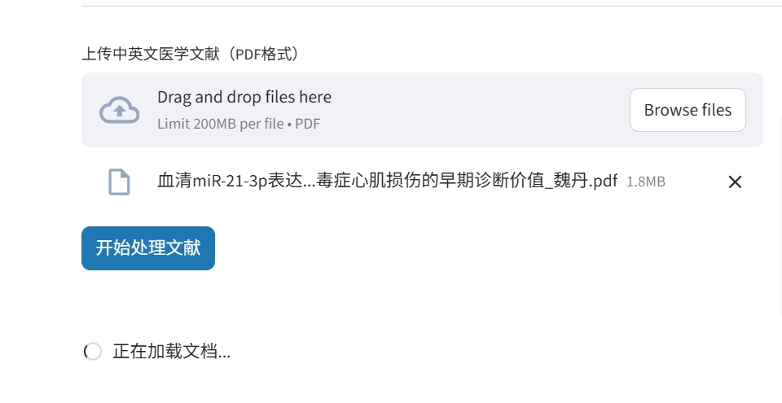
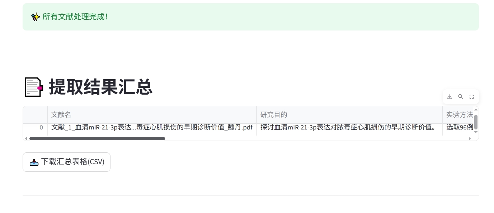
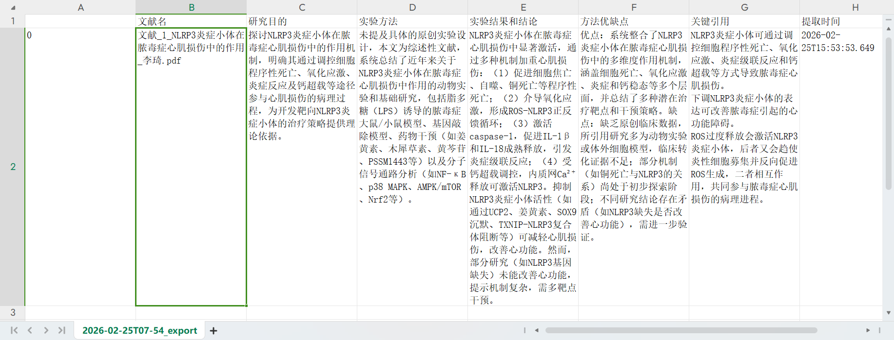
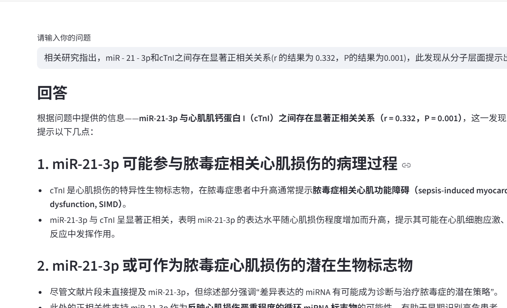

# 医学文献写作助手

一个基于人工智能的医学文献分析工具，帮助研究人员快速处理和分析PDF格式的医学文献。

- **痛点解决**：医学综述需要阅读几十篇文献，手动提取信息耗时费力。本项目通过RAG技术和Prompt工程，让AI帮你完成信息提取和整理工作

## 🌟 主要功能

- **批量文献处理**：支持同时上传多个PDF文献
- **智能信息提取**：自动提取研究目的、实验方法、实验结果等关键信息
- **交互式问答**：基于文献内容进行智能问答
- **综合分析**：提供研究方法汇总、结论对比等深度分析

## 🚀 快速开始

1. 访问应用网址：https://medical-literature-assistant-5hdks9anyvmrkjncxir6zf.streamlit.app/
2. 在左侧边栏输入您的通义千问API Key
3. 上传PDF格式的医学文献
4. 等待系统处理完成后查看分析结果

## 📸 界面操作指南

### 1. 主界面布局
应用采用左右分栏设计：
- **左侧边栏**：配置区域，用于输入API Key
- **右侧主区域**：文献上传和结果显示区域

### 2. API Key配置步骤
1. 在左侧边栏找到"⚙️ 配置"区域
2. 输入您的DashScope API Key（输入框会隐藏显示）
3. API Key获取方式详见下方"API Key获取"部分

### 3. 文献上传操作
1. 在主区域找到文件上传区域
2. 点击"浏览文件"或拖拽PDF文件到上传区域
3. 支持同时上传多个PDF文件
4. 文件大小建议不超过5MB
5. 点击"开始处理文献"按钮启动处理流程

### 4. 处理过程监控
系统会依次显示以下处理步骤：
- 正在初始化助手...
- 正在加载文档...
- 正在分割文档...
- 正在创建向量索引...
- 正在批量提取信息...

### 5. 结果查看与导出
处理完成后，您可以看到：
- **提取结果汇总表格**：显示所有文献的关键信息
- **下载按钮**：可将结果导出为CSV格式
- **智能问答**：基于文献内容进行提问
- **综合分析**：提供多维度的文献分析

## 🔧 技术栈

- **前端框架**：Streamlit
- **AI模型**：通义千问系列模型
- **文档处理**：LangChain + PyPDF
- **向量存储**：ChromaDB

## 📝 使用说明

### 系统要求
- 支持的文件格式：PDF
- 建议文件大小：单个文件不超过5MB
- 需要有效的通义千问API Key

### 功能介绍

1. **文献上传**：支持多文件同时上传
2. **信息提取**：自动识别文献中的关键信息
3. **智能问答**：基于文献内容回答相关问题
4. **数据分析**：提供多种维度的文献分析

## 🔐 API Key 获取

请访问 [阿里云百炼平台](https://help.aliyun.com/) 获取您的API Key。

## 🐛 遇到问题？

联系我：[微信：wxid_pjvagipl1cj422]

## 📝 更新记录

**v1.0** (2024.02.25)
- 首次发布
- 支持文献上传和信息提取
- 支持问答功能和综合分析功能
- 支持表格导出

## 📄 许可证

MIT License
